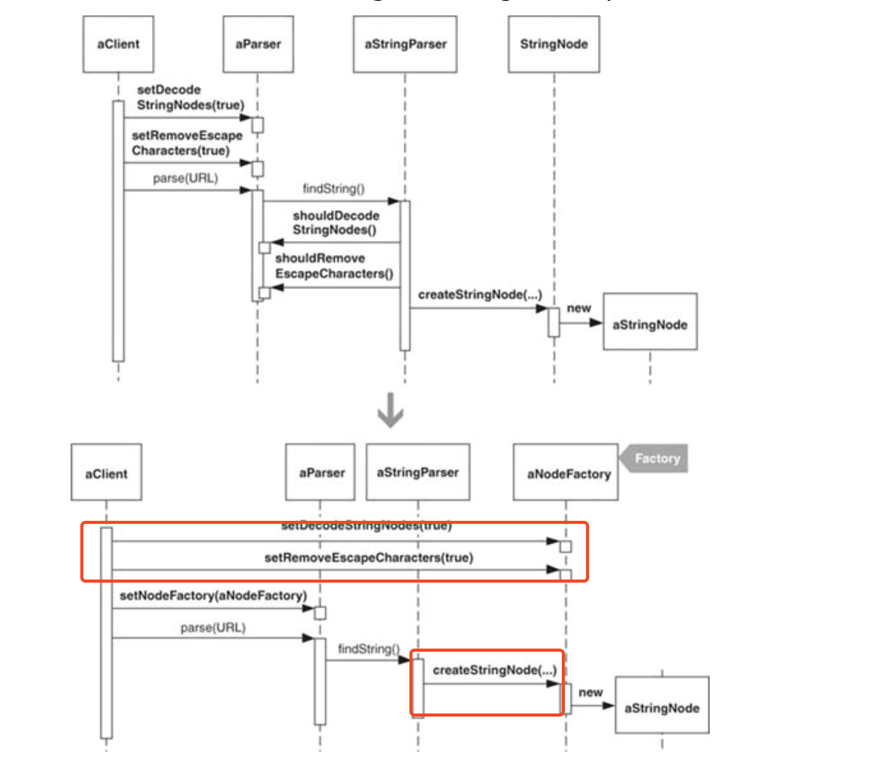

1. make StringParser perform its instantiation of StringNode objects by using a Creation Method.

2. Now I create a new class that will become a factory for StringNode objects. Because a StringNode is a type of Node, I name the class NodeFactory

3. Move Method [F] to move StringNode’s Creation Method to NodeFactory. 

   1.  the StringParser to instantiate a NodeFactory and call it to create a StringNode

4. moving the appropriate creation code from other classes(In this case the other class is the **Parser**, which the StringParser calls to pass an argument to the NodeFactory during StringNode creation:) into the NodeFactory.
   ```
   return nodeFactory.createStringNode(textBuffer, textBegin, textEnd, parser.shouldDecodeStringNodes());
   ```

   1. [**Think** ]Can move the following Parser code to the NodeFactory directly ? -- NO

      ```
      private boolean shouldDecodeStringNodes = false;
      
      public void setDecodeStringNodes(boolean shouldDecode) {
          this.shouldDecodeStringNodes = shouldDecode;
      }
      
      public boolean shouldDecodeStringNodes() {
          return shouldDecodeStringNodes;
      }
      ```

      > Why ?
      >
      > 1.  can’t simply move this code into the NodeFactory because clients of this code are clients of the parser which call Parser methods like setNodeDecoding(…) to configure the parser for a given parse.
      >
      > 2.  NodeFactory is not even visible to parser clients: it is instantiated by StringParser, which itself is not visible to parser clients.
      >
      > [Conlusion] NodeFactory instance must be accessible to both Parser clients and the StringParser. 

   2. How to make  NodeFactory instance be accessible to both **Parser clients**  and the **StringParser** ?

      1.  **Extract Class** on the Parser code I want to eventually merge with the NodeFactory.

         Before

         **[Parser]**

         ```
         public class Parser {
         		....
         
             private boolean shouldDecodeStringNodes = false;
         
             public void setDecodeStringNodes(boolean shouldDecode) {
                 this.shouldDecodeStringNodes = shouldDecode;
             }
         
             public boolean shouldDecodeStringNodes() {
                 return shouldDecodeStringNodes;
             }
         }
         ```

         

         After

         **[StringNodeParsingOption]** new class

         ```
         public class StringNodeParsingOption {
             public boolean shouldDecodeStringNodes = false;
         
             public StringNodeParsingOption() {
             }
         
             public void setDecodeStringNodes(boolean shouldDecode) {
                 this.shouldDecodeStringNodes = shouldDecode;
             }
         
             public boolean shouldDecodeStringNodes() {
                 return shouldDecodeStringNodes;
             }
         }
         ```

         

         **[Parser 等价替换]** replaces the shouldDecodeNodes field, getter, and setter with a StringNodeParsingOption field and its getter and setter 

         ```
         public class Parser {
             private StringNodeParsingOption stringNodeParsingOption = new StringNodeParsingOption();
         
             public StringNodeParsingOption getStringNodeParsingOption() {
                 return stringNodeParsingOption;
             }
         
             public void setStringNodeParsingOption(StringNodeParsingOption option) {
                 stringNodeParsingOption = option;
             }
         
         ```

         

         **[StringParser]** The StringParser now obtains the state of the StringNode decoding option by  means of the new class

         Before

         ```
         public Node findString(StringBuffer textBuffer, int textBegin, int textEnd) {
                 // 创建 StringNode 实例
                 NodeFactory nodeFactory = new NodeFactory();
                 return nodeFactory.createStringNode(textBuffer, textBegin, textEnd, parser.shouldDecodeStringNodes()); //修改的位置
             }
         ```

         After 

         ```
         public Node findString(StringBuffer textBuffer, int textBegin, int textEnd) {
                 // 创建 StringNode 实例
                 NodeFactory nodeFactory = new NodeFactory();
                 return nodeFactory.createStringNode(textBuffer, textBegin, textEnd, parser.getStringNodeParsingOption().shouldDecodeStringNodes());
             }
         ```

         

         **【DecodingNodeTest/Client】**clients(DecodingNodeTest) now turn StringNode decoding on by instantiating and configuring a StringNodeParsingOption instance and **passing** it to the parser

         Before

         ````
         parser.setDecodeStringNodes(true);
         ````


         After

         ```
         StringNodeParsingOption decodeNodes = new StringNodeParsingOption();
         decodeNodes.setDecodeStringNodes(true);
         parser.setStringNodeParsingOption(decodeNodes);
         ```

      2. Inline class to merge NodeFactory with StringNodeParsing-Option.

         * 移花接木（修改路由）
         * // Step 1 Move the Factory creation method to middle class
         * // Step 2 route the call of creation method to middle class
         * 
         * 清理现场
         * delete the Factory method (not used by others)
         2. rename middle class to Factory
         3. rename parser's(who called the middle class before) factory get and set method

      

> 

Why ?

1.  can’t simply move this code into the NodeFactory because clients of this code are clients of the parser which call Parser methods like setNodeDecoding(…) to configure the parser for a given parse.

2. NodeFactory is not even visible to parser clients: it is instantiated by StringParser, which itself is not visible to parser clients.

=============
How ?
1. Extract Class

   * 【Parser】move the shouldDecodeNodes field, getter, and setter  to new class 【StringNodeParsingOption】

     Before

     ```
     public class Parser {
     		....
     
         private boolean shouldDecodeStringNodes = false;
     
         public void setDecodeStringNodes(boolean shouldDecode) {
             this.shouldDecodeStringNodes = shouldDecode;
         }
     
         public boolean shouldDecodeStringNodes() {
             return shouldDecodeStringNodes;
         }
     }
     ```

     

     After

     [Parser] replaces the shouldDecodeNodes field, getter, and setter with a StringNodeParsingOption field and its getter and setter

     ```
     public class Parser {
         private StringNodeParsingOption stringNodeParsingOption = new StringNodeParsingOption();
     
         public StringNodeParsingOption getStringNodeParsingOption() {
             return stringNodeParsingOption;
         }
     
         public void setStringNodeParsingOption(StringNodeParsingOption option) {
             stringNodeParsingOption = option;
         }
     
     ```

     

     [StringNodeParsingOption] new class

     ```
     public class StringNodeParsingOption {
         public boolean shouldDecodeStringNodes = false;
     
         public StringNodeParsingOption() {
         }
     
         public void setDecodeStringNodes(boolean shouldDecode) {
             this.shouldDecodeStringNodes = shouldDecode;
         }
     
         public boolean shouldDecodeStringNodes() {
             return shouldDecodeStringNodes;
         }
     }
     ```

     [StringParser] The StringParser now obtains the state of the StringNode decoding option by  means of the new class

     Before

     ```
     public Node findString(StringBuffer textBuffer, int textBegin, int textEnd) {
             // 创建 StringNode 实例
             NodeFactory nodeFactory = new NodeFactory();
             return nodeFactory.createStringNode(textBuffer, textBegin, textEnd, parser.shouldDecodeStringNodes()); //修改的位置
         }
     ```

     After

     ```
     public Node findString(StringBuffer textBuffer, int textBegin, int textEnd) {
             // 创建 StringNode 实例
             NodeFactory nodeFactory = new NodeFactory();
             return nodeFactory.createStringNode(textBuffer, textBegin, textEnd, parser.getStringNodeParsingOption().shouldDecodeStringNodes());
         }
     ```

     


* 【DecodingNodeTest/Client】clients(DecodingNodeTest) now turn StringNode decoding on by instantiating and configuring a StringNodeParsingOption instance and **passing** it to the parser

  Before

  ````
  parser.setDecodeStringNodes(true);
  ````


  After

  ```
  StringNodeParsingOption decodeNodes = new StringNodeParsingOption();
  decodeNodes.setDecodeStringNodes(true);
  parser.setStringNodeParsingOption(decodeNodes);
  ```

  

2. Inline Class （merge NodeFactory with StringNodeParsingOption. ）