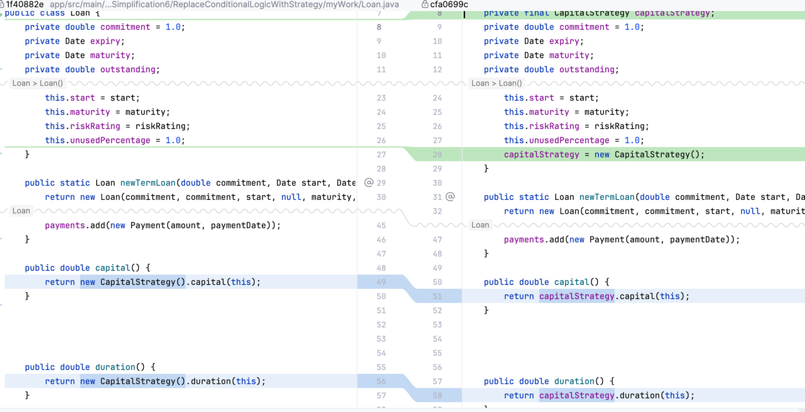
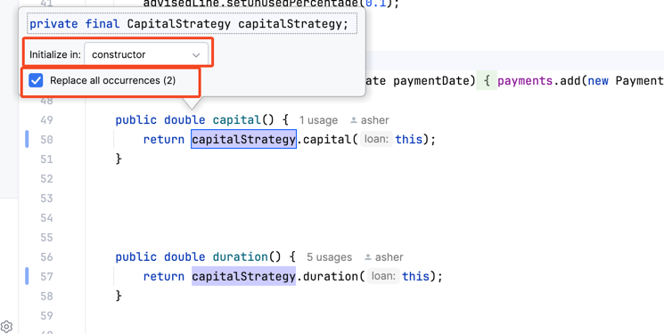

Lesson Learn
1. Move method (7a62f5d9)
if there are some dependencies for other not related information，
we can use Pass the context as a parameter to use it.
2. Remove duplication for initialization code (cfa0699c)
if there are some duplication for initialization code, 
we can use field to remove it and initialize it in constructor.
3. Extract parameter (eb7e99b1)
if we want client to pass the parameter, 
we can use this refactoring.

IDEA skill
1. introduce field to remove duplication of creation code

